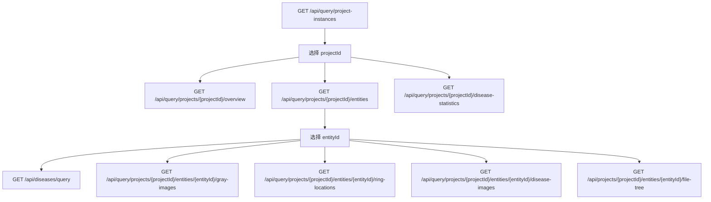

# 地铁隧道展示平台 API 调用说明

后端服务启动后，默认地址：

```text
http://localhost:5140
```

Swagger 文档地址：

```text
http://localhost:5140/swagger
```

## 调用顺序

客户端建议按这个顺序调用：

1. 获取工程实例列表

```http
GET /api/query/project-instances
```

返回里的 `projectId` 是工程实例 ID。后面所有 `{projectId}` 都用这个值。

2. 获取工程实例概览

```http
GET /api/query/projects/{projectId}/overview
```

用于显示工程名、上下行、采集日期、里程范围、病害总数、图片数、点云数。

3. 获取当前工程下的站点/区间

```http
GET /api/query/projects/{projectId}/entities
```

返回里的 `entityId` 是站点/区间 ID。后面所有 `{entityId}` 都用这个值。

4. 获取病害统计

当前工程实例统计：

```http
GET /api/query/projects/{projectId}/disease-statistics
```

当前站点/区间统计：

```http
GET /api/query/projects/{projectId}/disease-statistics?entityId={entityId}
```

5. 获取当前区间病害列表

```http
GET /api/diseases/query?ProjectInstanceId={projectId}&EntityId={entityId}&PageNumber=1&PageSize=200
```

可选筛选参数：

```text
DiseaseType=裂缝
MileageStart=100.0
MileageEnd=200.0
```

6. 获取二维灰度图

```http
GET /api/query/projects/{projectId}/entities/{entityId}/gray-images
```

返回里的 `fileUrl` 可直接作为图片地址，例如：

```text
http://localhost:5140{fileUrl}
```

7. 获取环片位置

```http
GET /api/query/projects/{projectId}/entities/{entityId}/ring-locations
```

也可以按图片里程范围过滤：

```http
GET /api/query/projects/{projectId}/entities/{entityId}/ring-locations?mileageStart=100&mileageEnd=200
```

8. 获取病害高清图

按区间获取全部高清图：

```http
GET /api/query/projects/{projectId}/entities/{entityId}/disease-images
```

按病害记录获取最匹配高清图：

```http
GET /api/query/projects/{projectId}/entities/{entityId}/diseases/{diseaseId}/best-image
```

9. 获取文件树，包括未来 04 点云帧文件

```http
GET /api/projects/{projectId}/entities/{entityId}/file-tree
```

客户端可以从返回树里找到名为 `04点云` 的目录，然后按文件名里的帧号排序显示。

## 点云浏览建议

当前样例 `04点云` 目录为空，前端已经预留“点云断面”主舞台。未来真实数据建议按帧号命名文件：

```text
000001.pcd
000002.pcd
frame_000003.ply
```

客户端推荐处理方式：

1. 调用 `GET /api/projects/{projectId}/entities/{entityId}/file-tree`。
2. 找到 `04点云` 目录。
3. 递归取出文件。
4. 从文件名提取数字作为帧号排序。
5. 用滑块或鼠标滚轮切换帧。
6. 如果要真实渲染点云，可接入 `Three.js` 或 `Potree`，在中间主舞台显示抽稀后的隧道断面。

## 前端展示调用关系

推荐页面加载顺序：



## Qt/C++ 调用建议

同事如果使用 `C++ Qt` 做 C 端界面，推荐使用 Qt 自带的网络和 JSON 模块，不需要直接连接 PostgreSQL。

需要用到的 Qt 模块：

```cmake
find_package(Qt6 REQUIRED COMPONENTS Core Network Gui Widgets)

target_link_libraries(YourClient PRIVATE
    Qt6::Core
    Qt6::Network
    Qt6::Gui
    Qt6::Widgets
)
```

如果项目还是 Qt5，模块名类似：

```cmake
find_package(Qt5 REQUIRED COMPONENTS Core Network Gui Widgets)
target_link_libraries(YourClient PRIVATE Qt5::Core Qt5::Network Qt5::Gui Qt5::Widgets)
```

推荐在 C 端封装一个很薄的 API 类，例如 `TunnelApiClient`，专门负责 HTTP 请求；界面层只关心返回的数据。

## Qt/C++ 最小请求封装

```cpp
#include <QNetworkAccessManager>
#include <QNetworkReply>
#include <QNetworkRequest>
#include <QJsonDocument>
#include <QJsonObject>
#include <QJsonArray>
#include <QUrl>
#include <functional>

class TunnelApiClient : public QObject
{
    Q_OBJECT

public:
    explicit TunnelApiClient(QObject* parent = nullptr)
        : QObject(parent)
    {
    }

    void getJson(const QString& path,
                 std::function<void(const QJsonDocument&)> onSuccess,
                 std::function<void(const QString&)> onError)
    {
        const QUrl url(baseUrl + path);
        QNetworkRequest request(url);
        request.setHeader(QNetworkRequest::ContentTypeHeader, "application/json");
        request.setRawHeader("Accept", "application/json");

        QNetworkReply* reply = network.get(request);
        connect(reply, &QNetworkReply::finished, this, [reply, onSuccess, onError]() {
            const QByteArray body = reply->readAll();

            if (reply->error() != QNetworkReply::NoError) {
                onError(reply->errorString() + "\n" + QString::fromUtf8(body));
                reply->deleteLater();
                return;
            }

            QJsonParseError parseError;
            const QJsonDocument doc = QJsonDocument::fromJson(body, &parseError);
            if (parseError.error != QJsonParseError::NoError) {
                onError("JSON parse error: " + parseError.errorString());
                reply->deleteLater();
                return;
            }

            onSuccess(doc);
            reply->deleteLater();
        });
    }

    QString baseUrl = "http://localhost:5140";

private:
    QNetworkAccessManager network;
};
```

注意：`QNetworkAccessManager` 要长期持有，不建议每次请求都临时 new 一个，否则并发请求和生命周期管理容易出问题。

## Qt/C++ 页面加载示例

1. 获取工程实例列表，拿到 `projectId`。

```cpp
api->getJson("/api/query/project-instances",
    [this](const QJsonDocument& doc) {
        const QJsonArray projects = doc.array();
        if (projects.isEmpty()) {
            return;
        }

        const QJsonObject first = projects.first().toObject();
        const QString projectId = first.value("projectId").toString();
        const QString displayName = first.value("displayName").toString();

        // TODO: 填充工程下拉框，并保存 projectId。
        loadEntities(projectId);
    },
    [](const QString& error) {
        qWarning() << error;
    });
```

2. 根据 `projectId` 获取站点/区间，拿到 `entityId`。

```cpp
void MainWindow::loadEntities(const QString& projectId)
{
    api->getJson(QString("/api/query/projects/%1/entities").arg(projectId),
        [this, projectId](const QJsonDocument& doc) {
            const QJsonArray entities = doc.array();
            for (const QJsonValue& value : entities) {
                const QJsonObject item = value.toObject();
                const QString entityId = item.value("entityId").toString();
                const QString name = item.value("displayName").toString();
                const double beginMileage = item.value("beginMileage").toDouble();
                const double endMileage = item.value("endMileage").toDouble();

                // TODO: 填充站点/区间列表。
            }
        },
        [](const QString& error) {
            qWarning() << error;
        });
}
```

3. 根据 `projectId + entityId` 获取病害列表。

```cpp
QString path = QString("/api/diseases/query?ProjectInstanceId=%1&EntityId=%2&PageNumber=1&PageSize=200")
    .arg(projectId, entityId);

api->getJson(path,
    [this](const QJsonDocument& doc) {
        const QJsonObject root = doc.object();
        const QJsonArray items = root.value("items").toArray();

        for (const QJsonValue& value : items) {
            const QJsonObject disease = value.toObject();
            const QString diseaseId = disease.value("diseaseId").toString();
            const QString type = disease.value("diseaseType").toString();
            const double mileage = disease.value("mileage").toDouble();

            // TODO: 填充病害表格。单击行时可按 mileage 联动二维灰度图。
        }
    },
    [](const QString& error) {
        qWarning() << error;
    });
```

4. 获取二维灰度图，并拼接图片地址。

```cpp
api->getJson(QString("/api/query/projects/%1/entities/%2/gray-images").arg(projectId, entityId),
    [this](const QJsonDocument& doc) {
        const QJsonArray images = doc.array();
        for (const QJsonValue& value : images) {
            const QJsonObject image = value.toObject();
            const QString fileName = image.value("fileName").toString();
            const QString fileUrl = image.value("fileUrl").toString();
            const QString fullUrl = api->baseUrl + fileUrl;
            const double beginMileage = image.value("beginMileage").toDouble();
            const double endMileage = image.value("endMileage").toDouble();

            // TODO: 保存到图片列表，QLabel/QGraphicsView 可直接加载 fullUrl。
        }
    },
    [](const QString& error) {
        qWarning() << error;
    });
```

## Qt/C++ 图片与叠加层

如果使用 `QLabel` 显示图片，可以这样异步下载：

```cpp
void MainWindow::loadImageToLabel(const QString& fullUrl, QLabel* label)
{
    QNetworkRequest request(QUrl(fullUrl));
    QNetworkReply* reply = imageNetwork.get(request);

    connect(reply, &QNetworkReply::finished, this, [reply, label]() {
        const QByteArray bytes = reply->readAll();
        QPixmap pixmap;
        pixmap.loadFromData(bytes);

        label->setPixmap(pixmap.scaled(
            label->size(),
            Qt::KeepAspectRatio,
            Qt::SmoothTransformation));

        reply->deleteLater();
    });
}
```

如果后续要在图片上画环片、病害点，建议使用 `QGraphicsView + QGraphicsScene`，不要只用 `QLabel`。原因是 `QGraphicsView` 更适合叠加图层：

- 底图：二维灰度图。
- 环片：按里程换算成 x 坐标后画竖线。
- 病害：按病害里程换算成 x 坐标后画点或框。
- 交互：单击病害列表时定位到对应图像和标记。

病害联动二维图像的核心算法：

```cpp
// diseaseMileage 落在 [beginMileage, endMileage] 内，则说明该病害属于这张灰度图。
double ratio = (diseaseMileage - beginMileage) / (endMileage - beginMileage);
double x = ratio * imageDisplayWidth;
```

如果样例数据里程不对齐，可以先跳到“最近里程”的图片做预览；正式数据里程统一后，就可以按真实位置叠加。

## Qt/C++ 点云浏览建议

当前后端通过文件树接口返回 `04点云` 目录。C 端可先按以下方式做第一版：

1. 调用 `GET /api/projects/{projectId}/entities/{entityId}/file-tree`。
2. 递归查找名称为 `04点云` 的目录。
3. 递归取出该目录下所有文件。
4. 从文件名提取数字作为帧号，例如 `000001.pcd`、`frame_000002.ply`。
5. 按帧号排序，用滑块、上一帧、下一帧控制浏览。
6. 第一阶段可以只显示帧号和文件信息；第二阶段再接入 PCL、OpenGL 或 Qt3D 渲染点云断面。

如果同事用 Qt 做点云渲染，技术路线建议：

- 简单预览：`QGraphicsView` 绘制抽稀后的断面点。
- 专业三维：`QOpenGLWidget` + PCL/OpenGL。
- 如果只看单帧断面，不需要一上来做复杂三维场景，先把“按帧号浏览 + 断面点显示”打通更稳。

## C# 调用示例

```csharp
using System.Net.Http.Json;

using var client = new HttpClient
{
    BaseAddress = new Uri("http://localhost:5140")
};

var projects = await client.GetFromJsonAsync<List<ProjectSummaryDto>>(
    "/api/query/project-instances");

var projectId = projects![0].ProjectId;

var entities = await client.GetFromJsonAsync<List<ProjectEntitySummaryDto>>(
    $"/api/query/projects/{projectId}/entities");

var entityId = entities![0].EntityId;

var diseases = await client.GetFromJsonAsync<DiseaseQueryResponseDto>(
    $"/api/diseases/query?ProjectInstanceId={projectId}&EntityId={entityId}&PageSize=200");
```

## 注意事项

- `projectId` 是工程实例 ID，不是线路 ID。
- 不要使用 Swagger 默认示例 GUID，例如 `3fa85f64-5717-4562-b3fc-2c963f66afa6`。
- 图片接口返回的 `fileUrl` 是相对路径，客户端访问时需要拼接服务地址。
- 当前样例数据的灰度图里程和环片里程不是同一套，因此演示页面会按环序预览；正式数据里程对齐后会按真实里程叠加。
- 如果 04 点云未来按帧号命名，建议文件名包含连续数字，例如 `000001.pcd`、`000002.pcd`、`frame_000003.ply`，客户端即可按数字排序做连续浏览。
- 页面上的工程信息、病害统计、二维图像、点云断面都来自 API，不建议客户端直接访问 PostgreSQL。
