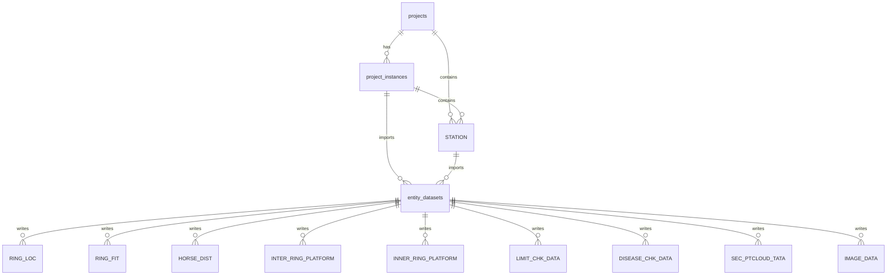
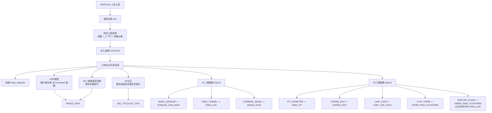

# 数据库结构与流程图

本文说明当前 PostgreSQL 数据库 `tunnel_platform` 的实际设计。当前版本已经以《地铁隧道平台展示软件概要设计V2.2.docx》6.2 中的成果表为主体，并在其基础上补充工程实例、上传批次、外键和索引。

## 1. 设计原则

Word 6.2 中的表适合表达隧道检测成果，但原始设计更接近单工程成果库。当前平台需要在一个 PostgreSQL 中保存多线路、多上下行、多采集日期和多站点/区间，所以必须增加平台上下文字段。

当前原则：

- 不再维护早期临时运行表作为成果主表。
- 保留 Word 成果表名称和主要语义。
- 给成果表补充 `ProjectInstanceId`、`StationID`、`DatasetId` 等上下文字段。
- 用外键和索引保证查询、覆盖上传和删除工程实例时的数据边界清晰。

## 2. 核心表分层

### 平台上下文表

| 表 | 作用 |
| --- | --- |
| `projects` | 线路/逻辑工程，例如北京地铁6号线 |
| `project_instances` | 工程实例，即线路 + 上下行 + 采集日期 |
| `STATION` | 当前工程实例下的站点/区间快照 |
| `entity_datasets` | 某工程实例下某站点/区间的一次上传批次 |

### Word 增强成果表

| 表 | 作用 |
| --- | --- |
| `RING_LOC` | 环片位置 |
| `RING_FIT` | 环片收敛/拟合直径 |
| `HORSE_DIST` | 水平距离 |
| `INTER_RING_PLATFORM` | 环间错台 |
| `INNER_RING_PLATFORM` | 环内错台 |
| `LIMIT_CHK_DATA` | 限界检测 |
| `DISEASE_CHK_DATA` | 病害检测 |
| `SEC_PTCLOUD_TATA` | 点云文件索引，保留原表名 |
| `SEC_PTCLOUD_DATA` | 指向 `SEC_PTCLOUD_TATA` 的兼容视图 |
| `IMAGE_DATA` | 灰度图、高清病害图、拼接图索引 |

## 3. 外键关系图



所有成果表都至少关联：

```text
DatasetId -> entity_datasets.Id
ProjectInstanceId -> project_instances.Id
StationID -> STATION.ID
```

## 4. 导入流程图



## 5. 数据来源映射

| Word 表 | 当前来源 |
| --- | --- |
| `STATION` | `台账.xlsx` |
| `RING_LOC` | 优先 2D `RING_TUNNEL`；无 2D 时 3D `CIRCLED_FLAKE` |
| `RING_FIT` | 3D `FIT_DIAMETER` |
| `HORSE_DIST` | 3D `HORSE_DIST` |
| `INTER_RING_PLATFORM` | 3D `PLAT_FORM` |
| `INNER_RING_PLATFORM` | 3D `CIRCLED_FLAKE` |
| `LIMIT_CHK_DATA` | 3D `LIMIT_DATA` |
| `DISEASE_CHK_DATA` | 优先 2D `BASIC_DISEASE`；无 2D 时 3D 病害表 |
| `SEC_PTCLOUD_TATA` | `04点云` 文件索引 |
| `IMAGE_DATA` | `03灰度图`、`05二维病害高清图`、2D `COMBINE_IMAGE` |

## 6. 二维优先规则

当前导入逻辑已经落实：

- 存在 `01二维数据` 时，病害以 2D 为准。
- 存在 `01二维数据` 时，环片位置以 2D 为准。
- 3D 的结构成果仍保留并写入对应结构表。
- 没有 2D 时，才使用 3D 病害和 3D 环片位置补充展示数据。

## 7. 查询索引

高频查询围绕：

- 工程实例
- 站点/区间
- 里程范围
- 病害类型
- 图片类型

核心索引包括：

- `STATION(ProjectInstanceId, EntityCode)`
- `STATION(ProjectInstanceId, StationType, BegMileage, EndMileage)`
- `DISEASE_CHK_DATA(ProjectInstanceId, StationID, DiseaseMileage)`
- `DISEASE_CHK_DATA(ProjectInstanceId, DiseaseName, DiseaseMileage)`
- `IMAGE_DATA(ProjectInstanceId, StationID, ImageType, BegMileage, EndMileage)`
- `IMAGE_DATA(ProjectInstanceId, StationID, DiseaseType, CenterMileage)`
- 各结构成果表的 `ProjectInstanceId + StationID + Mileage/BegMileage`

## 8. 前端查询路径

展示平台建议调用 API，而不是直接读数据库：

- 工程实例：`GET /api/query/project-instances`
- 工程概览：`GET /api/query/projects/{projectId}/overview`
- 站点/区间：`GET /api/query/projects/{projectId}/entities`
- 里程范围：`GET /api/query/projects/{projectId}/mileage-range`
- 病害统计：`GET /api/query/projects/{projectId}/disease-statistics`
- 当前区间病害统计：`GET /api/query/projects/{projectId}/disease-statistics?entityId={entityId}`
- 病害列表：`GET /api/diseases/query`
- 灰度图：`GET /api/query/projects/{projectId}/entities/{entityId}/gray-images`
- 环片：`GET /api/query/projects/{projectId}/entities/{entityId}/ring-locations`
- 高清病害图：`GET /api/query/projects/{projectId}/entities/{entityId}/disease-images`
- 点云帧文件树：`GET /api/projects/{projectId}/entities/{entityId}/file-tree`

## 9. 结论

当前数据库已经不是旧的临时运行表方案，而是“Word 设计表 + 平台上下文增强”的方案。这样既能满足工作要求中“以现有 Word 设计表为基础”的原则，又能保证平台后续按工程、区间、里程、病害类型和图像类型高效查询。
