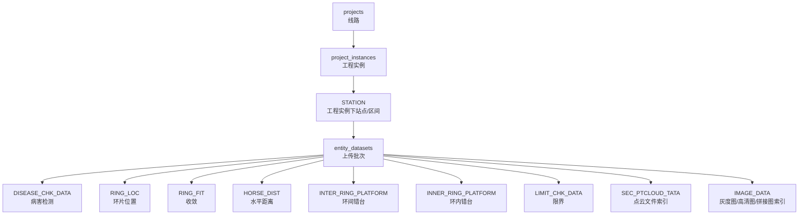

# 项目结构与软件逻辑

## 1. 项目定位

本项目用于把地铁隧道检测成果上传到本地服务器，并提供展示平台所需的查询接口和浏览界面。

系统由三部分组成：

- WinForms 上传工具：面向数据整理人员，负责台账同步、站点/区间选择、上传、删除和服务器文件树查看。
- .NET WebAPI：负责接收文件、解析 SQLite、写 PostgreSQL、提供 Swagger 和展示查询接口。
- Web 展示页面：由 API 直接托管，用于工程实例选择、二维图浏览、病害统计、病害列表、环片叠加和点云断面预览。

工程实例由台账自动确定：

```text
线路名称 + 上下行 + 采集日期
```

## 2. 根目录说明

| 路径 | 作用 |
| --- | --- |
| `台账.xlsx` | 示例台账，包含线路、上下行、采集日期、站点/区间、里程、区间类型、隧道类型等字段 |
| `用户上传数据` | 示例上传目录，每个站点/区间一个文件夹 |
| `服务器端保存格式` | 早期服务器保存格式参考 |
| `地铁隧道平台展示软件概要设计V2.2.docx` | 原始概要设计文档，包含 Word 6.2 数据库表和数据来源，不直接修改 |
| `Word表增强版映射说明.md` | 当前数据库与 Word 表之间的映射说明 |
| `数据库结构与流程图.md` | 当前数据库结构、外键关系和导入流程 |
| `统一库数据库设计V2.md` | 当前 Word 增强版数据库方案说明 |
| `统一库建表V2.sql` | 当前 Word 增强版建表参考脚本 |
| `TunnelPlatform` | .NET 解决方案 |
| `codex使用日志.docx` | AI 协作过程和竞赛展示素材 |

## 3. 解决方案结构

```text
TunnelPlatform
├─ TunnelPlatform.Api
├─ TunnelPlatform.Shared
├─ TunnelPlatform.WinForms
└─ server-storage
```

### TunnelPlatform.Shared

共享 DTO、请求模型和命名辅助方法。

关键文件：

- `Contracts/SharedContracts.cs`

主要内容：

- 台账同步 DTO。
- 工程实例、站点/区间、导入结果 DTO。
- 病害查询、图片查询、文件树 DTO。
- `LedgerNamingHelper`，用于解析台账字段并生成站点/区间编码。

### TunnelPlatform.WinForms

上传工具。

关键文件：

- `Program.cs`
- `Form1.Designer.cs`
- `Form1.cs`
- `Services/ApiClientService.cs`
- `Models/LocalEntityViewModel.cs`

主流程：

1. 用户选择 API 地址、台账和用户上传数据目录。
2. 点击同步台账，后端按 `线路名称 + 上下行 + 采集日期` 创建工程实例。
3. 用户选择工程实例和站点/区间。
4. WinForms 扫描固定目录：`01二维数据`、`02三维数据`、`03灰度图`、`04点云`、`05二维病害高清图`。
5. 上传到 WebAPI。
6. 后端保存文件、解析 SQLite、写入 PostgreSQL。
7. 上传完成后可查看服务器文件树。

### TunnelPlatform.Api

服务端和前端托管。

关键目录：

- `Controllers`：工程、上传、病害、展示查询接口。
- `Services`：台账同步、导入、文件树等业务逻辑。
- `Data`：EF Core DbContext 和数据库初始化。
- `Domain`：实体模型。
- `wwwroot`：展示平台前端页面。

关键文件：

- `Program.cs`：启动、依赖注入、Swagger、静态文件、数据库初始化。
- `Data/TunnelPlatformDbContext.cs`：EF Core 映射。
- `Data/DatabaseSchemaInitializer.cs`：创建 Word 增强版表、外键和索引。
- `Domain/Entities.cs`：平台上下文表和 Word 成果表实体。
- `Services/ProjectService.cs`：工程实例和台账同步。
- `Services/ImportService.cs`：核心导入逻辑。
- `Controllers/QueryController.cs`：展示平台查询接口。

## 4. 数据库逻辑

当前数据库以 Word 6.2 的成果表为基础，但补充平台上下文。



`ProjectInstanceId + StationID + DatasetId` 是所有成果查询和覆盖删除的关键上下文。

## 5. 导入规则

### 台账

- `线路名称`：工程/线路名称。
- `上下行`：工程实例行别。
- `采集时间` 或 `采集日期`：工程实例日期。
- `区间类型`：站点或区间。
- `隧道类型`：盾构、矿山法、明挖、`-1`。

### 灰度图

- 普通图片原样保存。
- `.db` 灰度图只读取 `thumbnail`，保存为 `db文件名.jpg`。
- 不上传 `tiles` 表中的高清切片。

### 二维优先

- 存在 `01二维数据` 时，`DISEASE_CHK_DATA` 优先来自 `BASIC_DISEASE`。
- 存在 `01二维数据` 时，`RING_LOC` 优先来自 `RING_TUNNEL`。
- 无 2D 时，才使用 3D 病害表和 3D `CIRCLED_FLAKE`。

### 三维结构成果

- `FIT_DIAMETER -> RING_FIT`
- `HORSE_DIST -> HORSE_DIST`
- `LIMIT_DATA -> LIMIT_CHK_DATA`
- `PLAT_FORM -> INTER_RING_PLATFORM`
- `CIRCLED_FLAKE -> INNER_RING_PLATFORM`

### 文件保存

服务器文件保存结构：

```text
工程名/上下行/采集日期/站点或区间编码/数据文件夹
```

## 6. 展示前端

入口：

```text
http://localhost:5140/
```

当前页面能力：

- 顶部工程实例选择和主题切换。
- 左侧站点/区间列表和病害列表。
- 中间主舞台支持 `二维图像` 和 `点云断面` 两个 Tab。
- 二维图像支持鼠标滚轮切换、环片叠加、时间轴。
- 点云断面支持未来按帧号浏览 `04点云` 文件。
- 右侧显示工程信息、病害统计和 API 状态。
- 病害统计支持当前区间和当前工程两种范围。

## 7. 本地运行

启动 API：

```powershell
dotnet run --project .\TunnelPlatform.Api\TunnelPlatform.Api.csproj
```

启动 WinForms：

```powershell
dotnet run --project .\TunnelPlatform.WinForms\TunnelPlatform.WinForms.csproj
```

如果 `5140` 端口被占用，说明 API 已经启动，需要关闭旧进程或换端口。

## 8. 当前状态

当前项目已经从“能上传、能查询”的工程验证阶段，进入“按 Word 设计表落库 + 可视化展示平台”的阶段。

最近验证：

```powershell
dotnet build .\TunnelPlatform.slnx
```

结果为 0 个错误、0 个警告。
